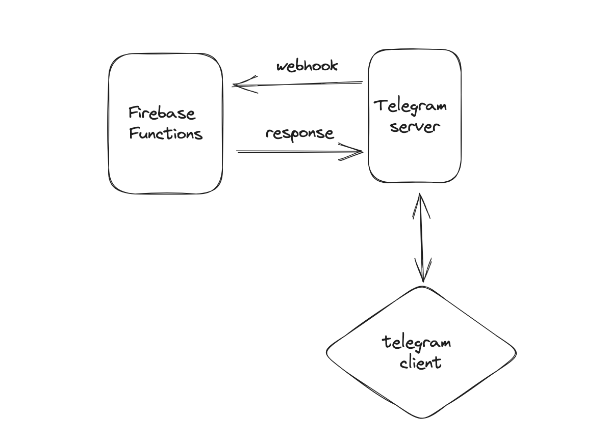

### 💬🤖 Telegram Bot

Serverless with Firebase functions.

### ⚙️ Technologies

-   Python
-   Firebase Functions
-   pyTelegramBotAPI

### 📦 Installation

1. Clone the repository:

```
https://github.com/jsonfm/telegram-serverless-bot-firebase.git
```

2. Create a virtual environment:

```
python3 -m venv venv
```

3. Activate the virtual environment:

```
source venv/bin/activate
```

4. Install the dependencies:

```
pip install -r requirements.txt
```

You will probably need the firebase cli, you can install it by following the [documentation](https://firebase.google.com/docs/cli) or executing:

```
npm install -g firebase-tools
```

You will also need to add the environment variables, see the `.env.example` file:

```
# FIREBASE
FIREBASE_PROJECT_ID=""
FIREBASE_PRIVATE_KEY_ID=""
FIREBASE_PRIVATE_KEY='{"key": "Some RSA key"}'
FIREBASE_CLIENT_EMAIL=""
FIREBASE_CLIENT_ID=""
FIREBASE_AUTH_URI=""
FIREBASE_TOKEN_URI=""
FIREBASE_PROVIDER_X509_CERT_URL=""
FIREBASE_CLIENT_X509_CERT_URL=""
FIREBASE_UNIVERSE_DOMAIN=""
FIREBASE_STORAGE=""
FIREBASE_WEB_API_KEY=""

# Telegram
TELEGRAM_API_KEY=""
TELEBRAM_BOT_USERNAME=""

# Webhook
WEBHOOK_URL=""
```

### ⚡️ Development

For running a local server execute:

```
firebase emulators:start
```

### 🚀 Deployment

```
firebase deploy --only functions
```
